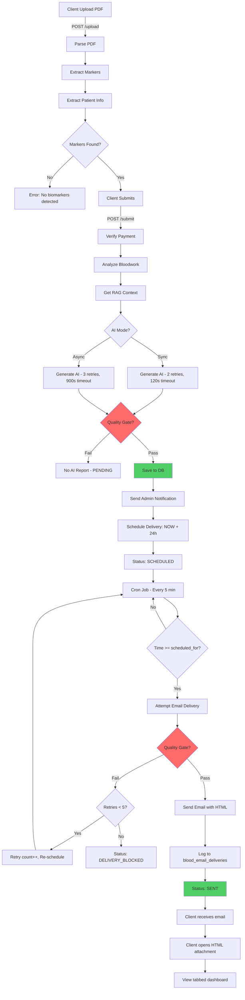
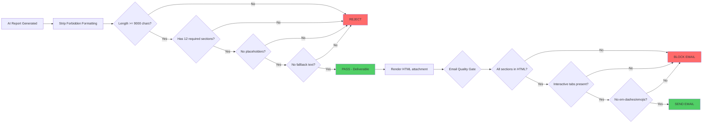
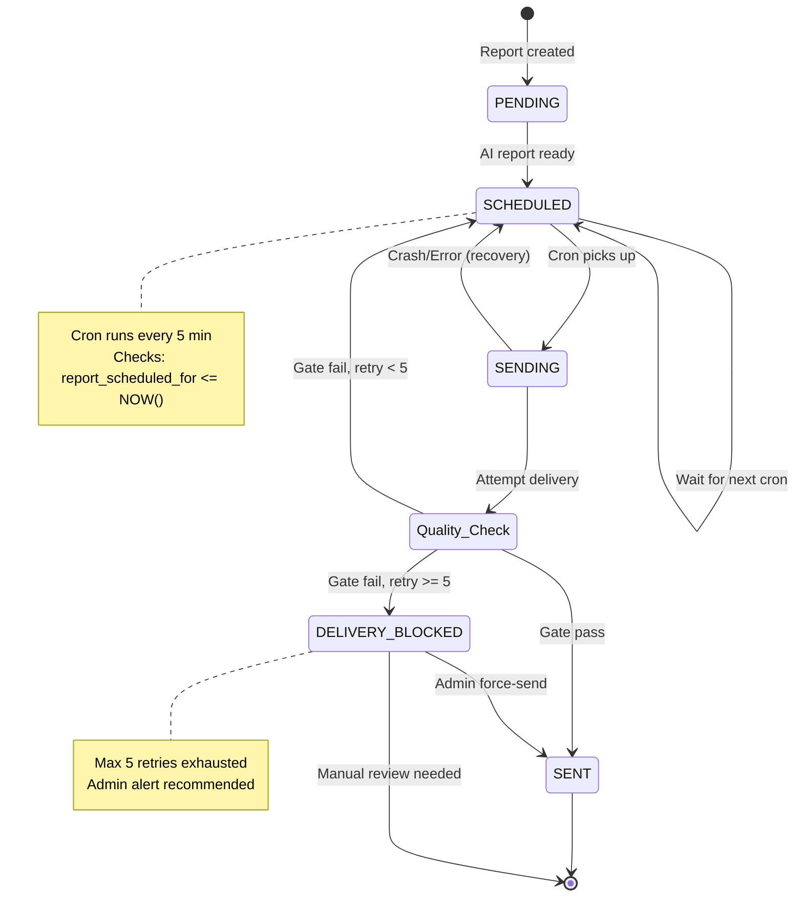
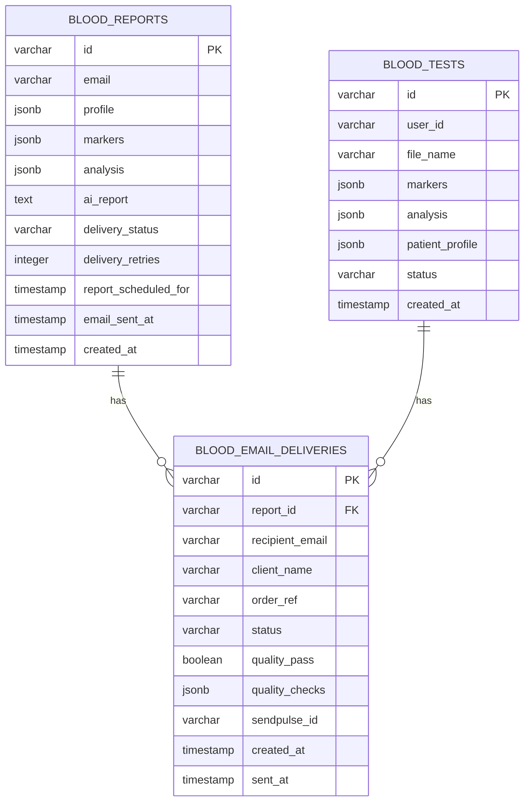
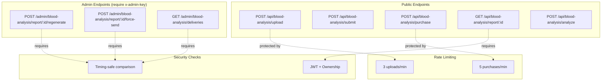
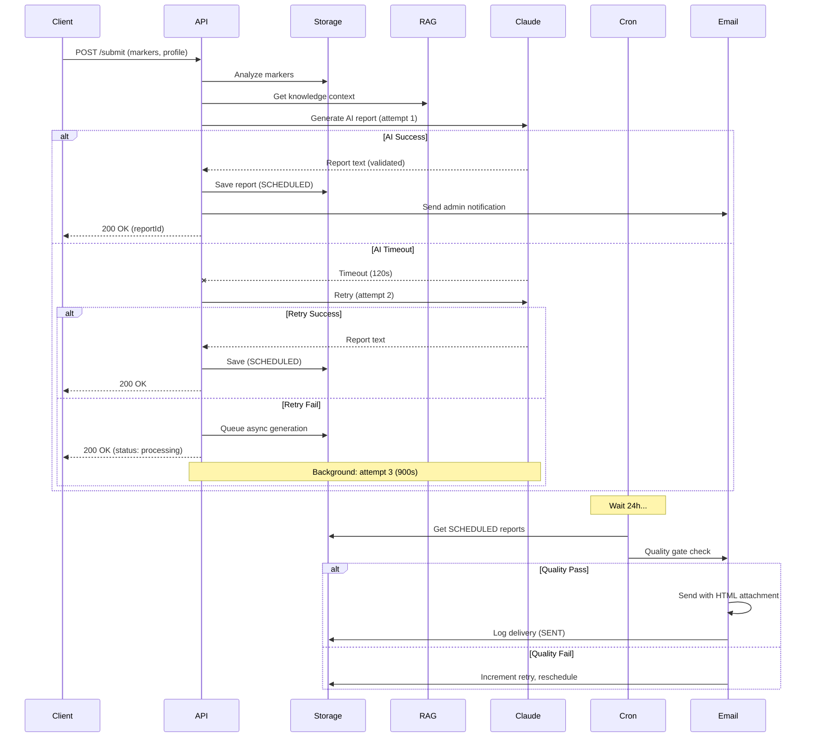
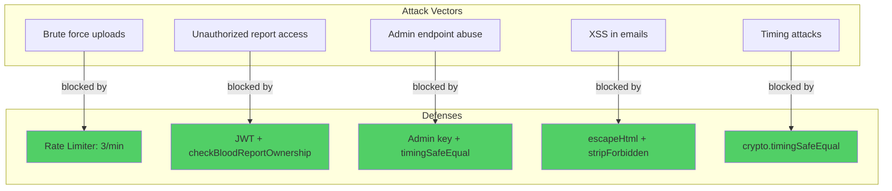
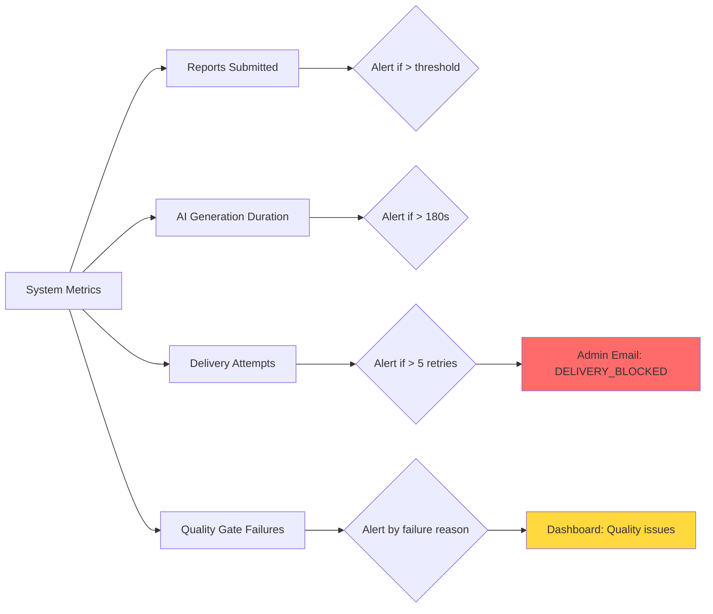

# Blood Analysis System - Flow Diagrams

## 1. Complete End-to-End Flow

## 2. Quality Gate Flow

## 3. Retry & Recovery Logic

## 4. Database Schema Relationships

## 5. API Endpoints Map

## 6. AI Generation Pipeline

## 7. Security Architecture

## 8. Monitoring Points

---

## Legend

- 🟢 Green: Success state
- 🔴 Red: Failure/block state
- 🟡 Yellow: Warning/retry state
- ⚪ White: Neutral/processing state

---

**Note:** Ces diagrammes peuvent être rendus avec Mermaid dans GitHub, GitLab, ou tools comme draw.io.

**Generated:** 2026-03-21
